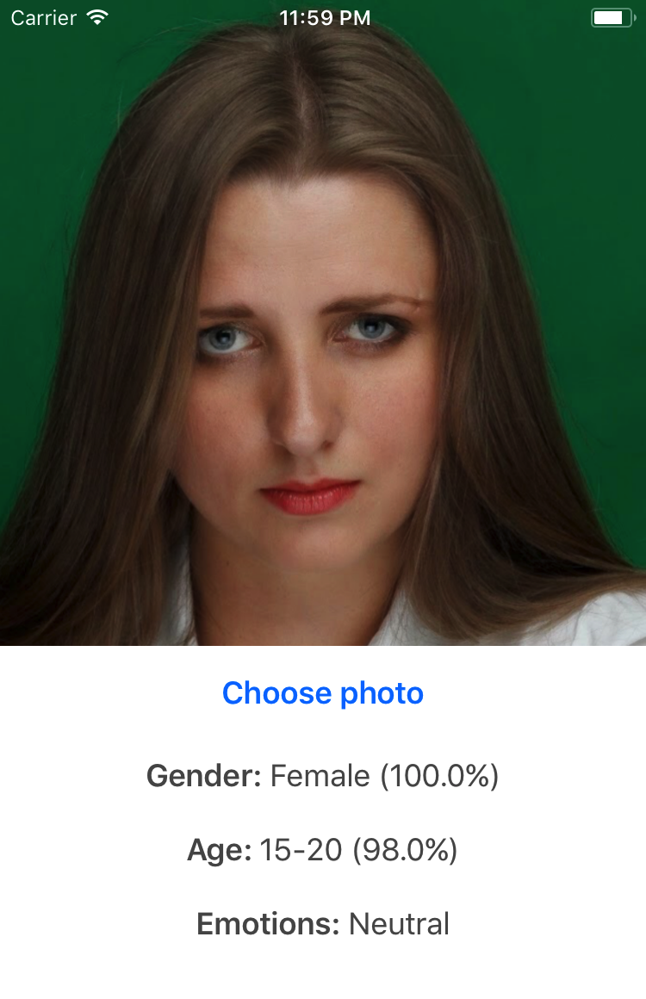

# Faces Vision Demo



A Demo application using `Vision` and `CoreML` frameworks for age and gender
classification of facial images.

## Model

This demo is based on the age, gender and emotion neural network classifiers,
which were converted from `Caffe` models to `CoreML` models using [coremltools](https://pypi.python.org/pypi/coremltools) python package.

### Age classification

- [Paper](http://www.openu.ac.il/home/hassner/projects/cnn_agegender/)
- [CoreML model](https://drive.google.com/file/d/0B1ghKa_MYL6mT1J3T1BEeWx4TWc/view?usp=sharing)

### Gender classification

- [Paper](http://www.openu.ac.il/home/hassner/projects/cnn_agegender/)
- [CoreML model](https://drive.google.com/file/d/0B1ghKa_MYL6mYkNsZHlyc2ZuaFk/view?usp=sharing)

### Emotion Recognition

- [Paper](http://www.openu.ac.il/home/hassner/projects/cnn_emotions/)
- [CoreML model](https://drive.google.com/file/d/0B1ghKa_MYL6mTlYtRGdXNFlpWDQ/view?usp=sharing)

## Requirements

- Xcode 9
- iOS 11

## Installation

```sh
git clone https://github.com/cocoa-ml/FacesVisionDemo.git
cd FacesVisionDemo
pod install
open FacesVisionDemo.xcworkspace/
```

Download the [Age](https://drive.google.com/file/d/0B1ghKa_MYL6mT1J3T1BEeWx4TWc/view?usp=sharing),
[Gender](https://drive.google.com/file/d/0B1ghKa_MYL6mYkNsZHlyc2ZuaFk/view?usp=sharing) and
[Emotion](https://drive.google.com/file/d/0B1ghKa_MYL6mTlYtRGdXNFlpWDQ/view?usp=sharing)
CoreML models and drag the files into your project.

Build the project and run it on a simulator or a device with iOS 11.

## Author

Vadym Markov, markov.vadym@gmail.com

## Credits

- [Age and Gender Classification using Convolutional Neural Networks](http://www.openu.ac.il/home/hassner/projects/cnn_agegender/)
- [Emotion Recognition in the Wild via Convolutional Neural Networks and Mapped Binary Patterns](http://www.openu.ac.il/home/hassner/projects/cnn_emotions/)

## References
- [Caffe Model Zoo](https://github.com/caffe2/caffe2/wiki/Model-Zoo)
- [Apple Machine Learning](https://developer.apple.com/machine-learning/)
- [Vision Framework](https://developer.apple.com/documentation/vision)
- [CoreML Framework](https://developer.apple.com/documentation/coreml)
- [coremltools](https://pypi.python.org/pypi/coremltools)
